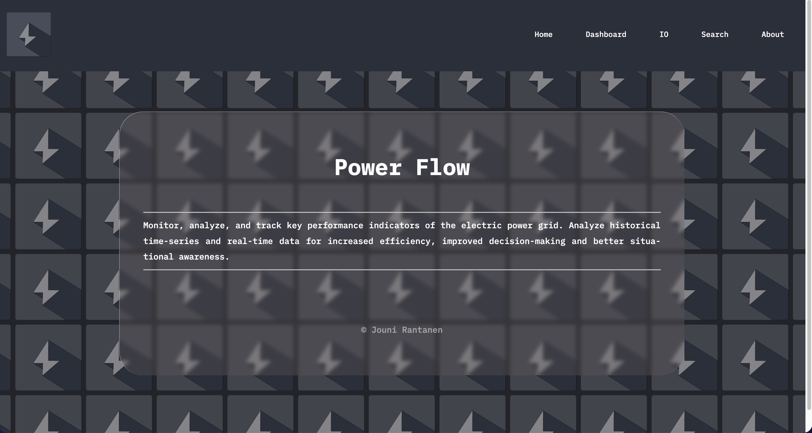
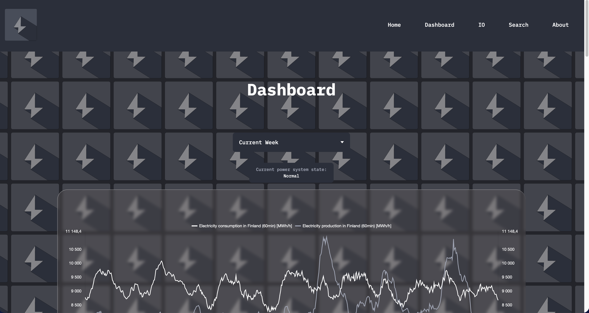
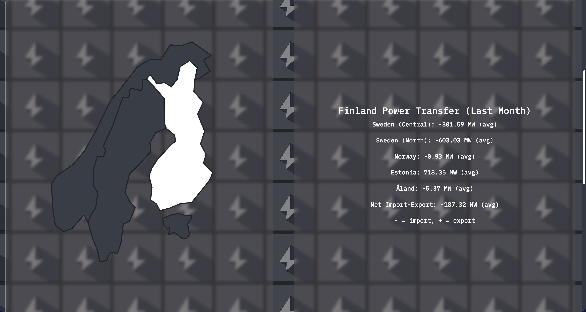
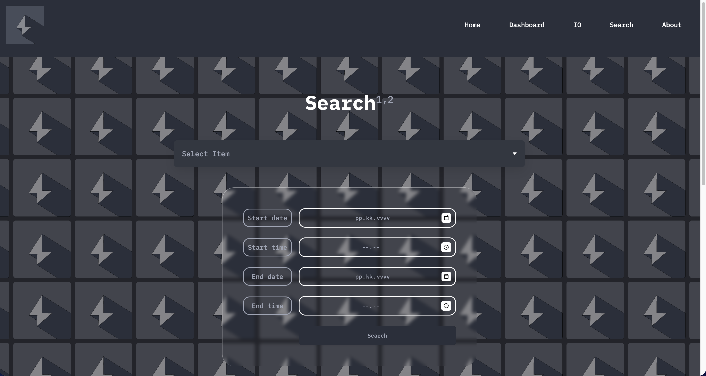

# Power Flow

## Description

[<b>Power Flow</b>](https://jouniverse.github.io/power-flow/home.html) is a data-analytics dashboard offering real-time insights into the electric power grid, facilitating smart decision-making for optimized performance and reliability. It is based on the <a href="https://data.fingrid.fi/en/"> API provided by Fingrid</a><sup>1</sup>. It allows you to access some of the key performance indicators (KPI) of the power grid as well as to search for all the available indicators.

<p><small>The following KPIs are covered in the dashboard and IO views: electricity consumption and production; hydro, nuclear, wind and solar power production; cogeneration of district heating and industrial cogeneration; kinetic energy of the power system; frequency, time-deviation and power transfer (import-export).</small></p>

## UI






## Usage

Run:

```bash
% npm install
% npm run dev
```

The API is throttled. According to the API definition: _"Service has throttling that is based on API keys: you can make 10 000 requests in 24h period and 10 requests in a minute with one API key."_ So, when you are using the app, please be prepared to wait for the charts to build.

Views:

- Dahboard view: shows the key performance indicators of the power grid.
- IO view: shows the net import/export of electricity.
- Search view: allows you to search for all the available indicators and to plot them.

## Data Source

<p><a href="https://www.fingrid.fi/en/">Fingrid</a> is a Finnish national electricity transmission grid operator. It's mission is:<blockquote><i>to secure the supply of energy in our society in all circumstances and to promote a clean, market-based power system.</i></blockquote></p>
<hr>

<p>The project is not constantly updated, and it will become defunct if there are breaking changes in the API.</p>

## License

MIT license.

The project is not associated with Fingrid, and it is not an official Fingrid product.

## Notes

<p class="sub-note"><sup>1</sup>Fingrid's own dashboard for the power grid is available <a href="https://www.fingrid.fi/en/electricity-market/power-system/">here</a>.</p>
